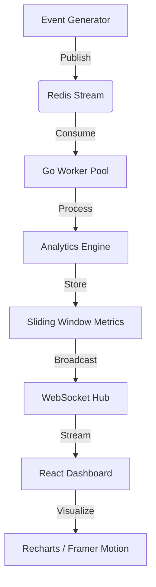

# Real-Time Monitoring & Analytics Engine

[](https://golang.org/)
[](https://reactjs.org/)
[](https://redis.io/)
[](https://tailwindcss.com/)
[](https://www.docker.com/)

A high-performance, scalable real-time analytics streaming system. This project implements a sliding-window analysis engine that ingests high-frequency events, processes them via a worker pool, and streams live metrics to a premium dashboard via WebSockets.

---

## Features

- **Real-Time Ingestion**: Handles high-frequency event streams using Redis Streams.
- **Sliding Window Analysis**: Processes metrics (event count, average value, total volume) within a configurable time window (e.g., 30s).
- **Worker Pool Architecture**: Scalable Go-based worker pool for concurrent event processing.
- **WebSocket Synchronization**: Pushes live engine telemetry to the frontend with sub-second latency.
- **Premium Dashboard**: A minimalist, dark-themed UI built with React, Recharts, and Framer Motion.
- **System Logs**: Live debug feed showing internal engine operations and ingestion stats.
- **Docker Ready**: Full orchestration with Docker Compose for easy deployment.

---

## Architecture



---

## Tech Stack

### Backend
- **Go**: Core logic and concurrency management.
- **Redis**: Message broker and event streaming (Redis Streams).
- **Gin**: Lightweight HTTP framework for API and WebSocket handling.
- **Goroutines**: Efficient parallel processing.

### Frontend
- **React (TypeScript)**: UI framework.
- **Tailwind CSS**: Utility-first styling with a premium dark aesthetic.
- **Recharts**: High-performance data visualization.
- **Framer Motion**: Smooth micro-animations and transitions.
- **Lucide React**: Minimalist iconography.

---

## Getting Started

### Prerequisites
- [Docker](https://www.docker.com/) & [Docker Compose](https://docs.docker.com/compose/)
- OR [Go 1.21+](https://golang.org/) & [Node.js 18+](https://nodejs.org/) & [Redis 7+](https://redis.io/)

### Using Docker (Recommended)
1. Clone the repository:
   ```bash
   git clone https://github.com/resonatingmind/real-time-monitoring.git
   cd real-time-monitoring
   ```
2. Start the services:
   ```bash
   docker-compose up --build
   ```
3. Access the dashboard at `http://localhost:5173`.

### Manual Setup
#### 1. Redis
Ensure Redis is running on `localhost:6379`.

#### 2. Backend
```bash
cd backend
go mod download
go run cmd/api/main.go
```

#### 3. Frontend
```bash
cd frontend
npm install
npm run dev
```

---

## Configuration

### Backend (`backend/.env`)
| Variable | Description | Default |
| :--- | :--- | :--- |
| `PORT` | Backend server port | `8080` |
| `REDIS_ADDR` | Redis connection address | `localhost:6379` |
| `STREAM_NAME` | Redis stream key for events | `events-stream` |
| `WORKER_COUNT`| Number of concurrent workers | `5` |
| `WINDOW_SIZE` | Sliding window duration | `30s` |

---

## Dashboard Overview

- **Event Rate**: Real-time events per second (eps).
- **Volume**: Cumulative monetary or value volume in the current window.
- **Average**: Mean value of events processed.
- **Live Logs**: Real-time telemetry feed from the ingestion engine.

---

## License
This project is licensed under the MIT License - see the LICENSE file for details.
